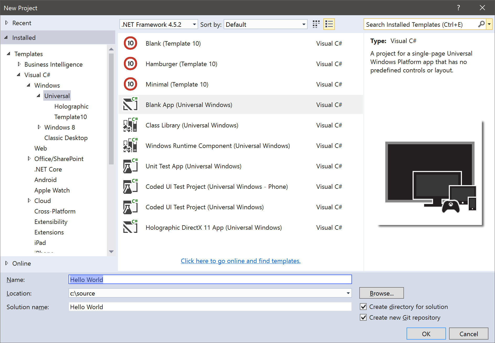
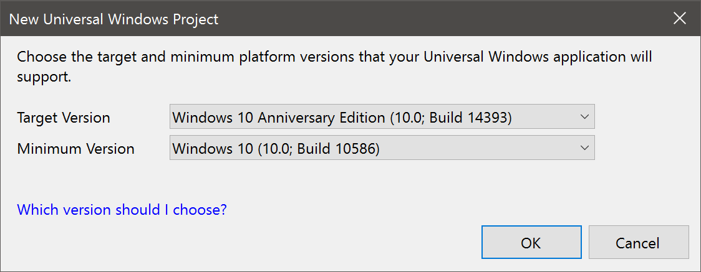
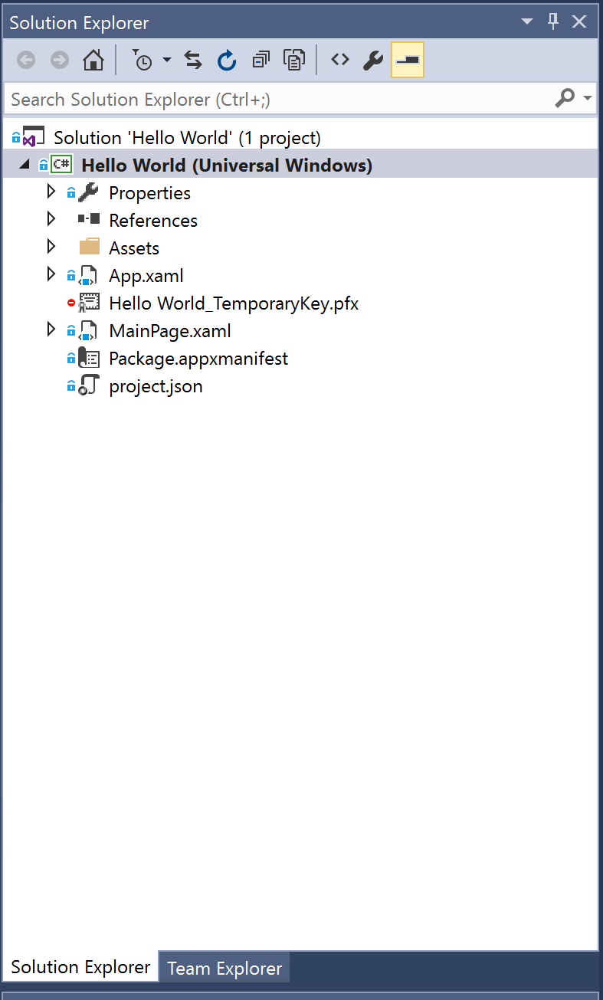
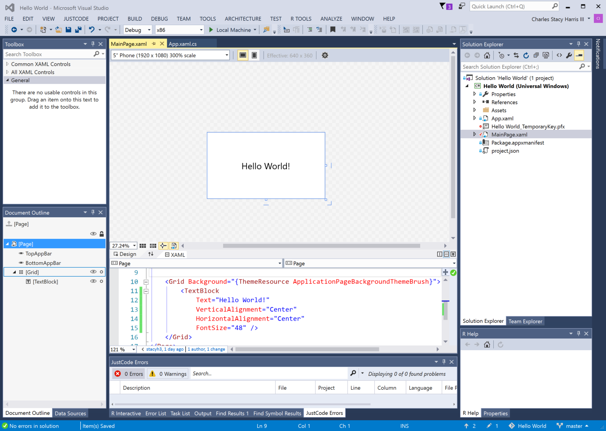
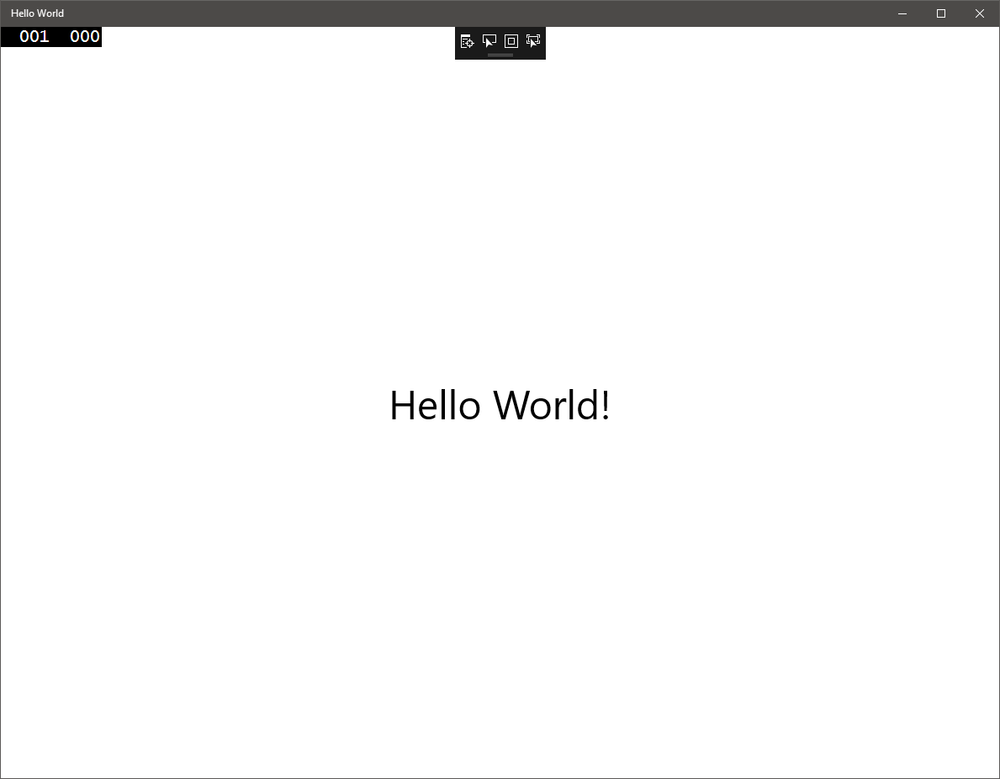
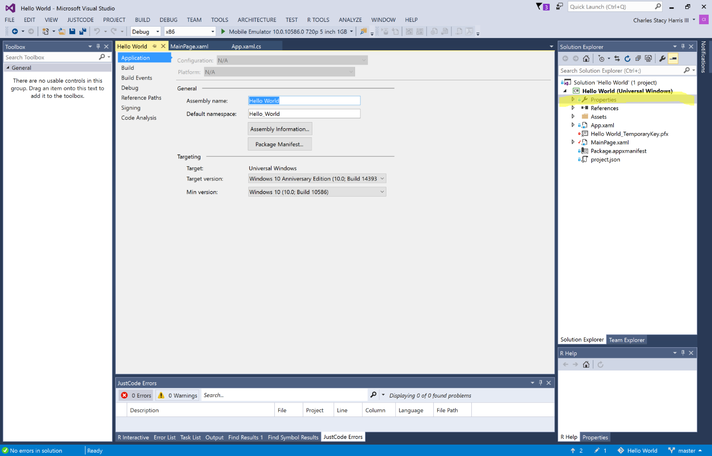
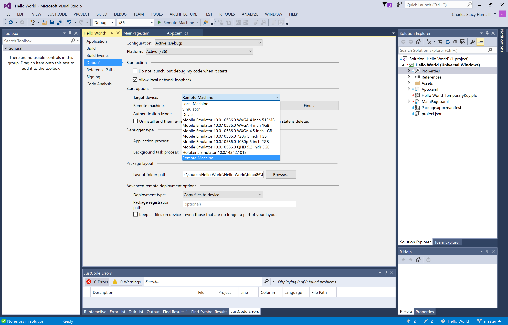
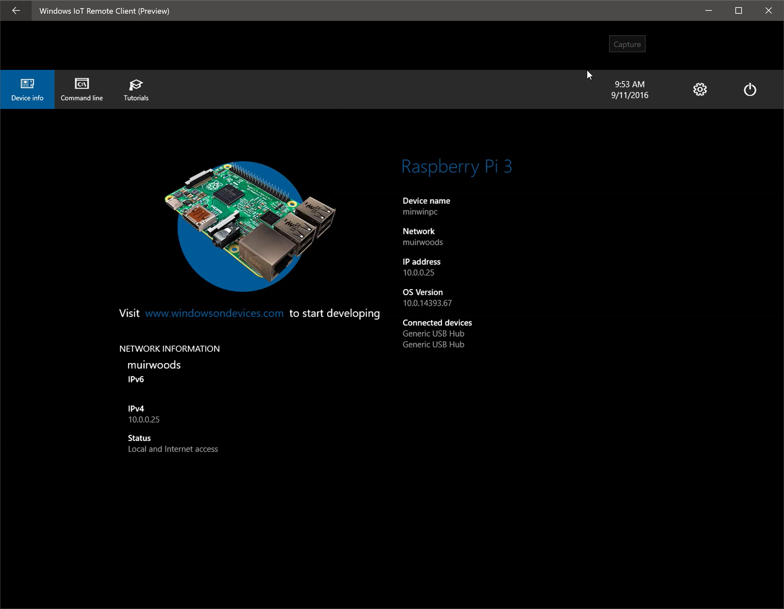

# Hello UWP
## A Sample Universal Windows Platform Application
The following sample shows a very basic application that we can run on multiple Windows device families.

### Hello World Step-by-step
1. Run ***Visual Studio 2015*** or later
2. Choose File | New | Project
3. Choose Installed | Templates | Visual C# | Windows | Universal
4. Choose the "Blank App (Universal Windows)" template
5. Name the project "Hello World"
6. Optionally change the location folder
7. Select OK

8. When the version dialog appears, note the minimum and maximum API versions are shown.
9. Select OK in the version dialog. Note that we target a specific UPW version min and max and NOT a Windows Version



#### Solution Files



There are some interesting things to note about the project structure.  
Open and examine each of these:

***App.xaml and App.xaml.cs***
* Note: XAML files are just XML files that create object hierarchies for code or visuals.
* App.xaml is an Extensible Markup Language (XAML) file where you declare resources that are used across the app.
* App.xaml.cs is the code-behind file for App.xaml. Like all code-behind pages, it contains a constructor that calls the InitializeComponent method. You don't write the InitializeComponent method. It's generated by Visual Studio, and its main purpose is to initialize the elements declared in the XAML file.
* Be careful not to delete the call to InitializeComponent! If you do, all of your GUI elements will disappear!
* App.xaml.cs is the entry point for your app.
* App.xaml.cs also contains methods to handle activation and suspension of the app.

***MainPage.xaml***
* MainPage.xaml is where you define the UI for your app. You can add elements directly using XAML markup, or you can use the design tools provided by Visual Studio.
* MainPage.xaml.cs is the code-behind page for MainPage.xaml. It's where you add your app logic and event handlers.
* Together these two files define a new class called MainPage, which inherits from Page, in the HelloWorld namespace.

***Package.appxmanifest***
A manifest file that describes your app: its name, description, tile, start page, etc.
Includes a list of the files that your app contains.

***Logos***
* Assets/Square150x150Logo.scale-200.png represents your app in the start menu.
* Assets/StoreLogo.png represents your app in the Windows Store.
* Assets/SplashScreen.scale-200.png is the splash screen that appears when your app starts.

***project.json***
* This file contains any package dependencies that you might have.
* Note, you can still use the Package Manager GUI for NuGet, and it will update this file. Give this a try.

### Modify and run the app
Let's add a simple text block to the application.
1. Open the MainPage.xaml file
2. Add the following XAML inside the Grid that's on the page.

```xaml
<TextBlock 
    Text="Hello World!" 
    VerticalAlignment="Center" 
    HorizontalAlignment="Center" 
    FontSize="48" />
```
3. You should see a screen that looks like this:

4. Click ***Local Machine*** to test the application on the desktop. You should see something like the following:


### Running on other platforms
#### Windows Phone
Next let's try running this application on a Windows Phone. We'll just use the phone emulator for this test.  
**Note**: This step requires that you installed the emulators. This can be done when you installed Visual Studio or you can download and install them here: [Windows SDK and emulator archive](https://developer.microsoft.com/en-us/windows/downloads/sdk-archive)  
This step will take a while the first time you run the emulator. 
1. In the dropdown next to ***Local Machine*** in the debug toolbar select a mobile emulator such as the 5" 720p 1G device

2. Click the run button in the debug toolbar. You should see something like this:

3. When you stop the application, use the red stop button in the debug toolbar. That way, the emulator will stay running if you need to keep using it.  

#### Raspberry Pi
**Note**: For instructions on getting started with Windows 10 IoT Core on Raspberry Pi, visit [http://www.windowsondevices.com](http://www.windowsondevices.com).
1. Double click on **Properties** in the solution explorer.

2. Click the **Debug** tab. Select **ARM** from the platform dropdown, then select **Remote Machine** from the **Target device** dropdown.

3. Click **Find** or type in the IP Address of your IoT device if you know it.

4. We're now ready to run on the Raspberry Pi. If you have a monitor connected to the Raspberry Pi, you should see this screen just before you run:

5. Click **Remote Machine** in the debug toolbar. It will take a couple of minutes to deploy the application package to the Raspberry Pi and start the remote debugger. The first time you run the debugger will be slower due to the need to install framework packages, etc.

6. Click the **red** box in the debug toolbar to stop debugging.